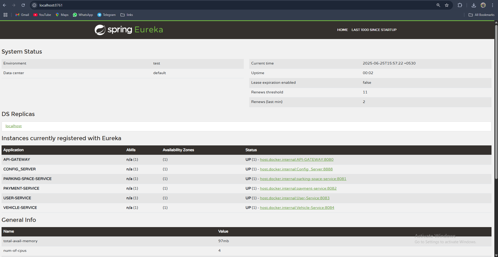

# 🚗 Smart Parking Management System (SPMS)

A microservices-based cloud-native system that enables real-time parking space management, vehicle tracking, secure payment processing, and role-based access using JWT.

---

## 📦 Microservices Overview

| Service            | Port | Description                                    |
|--------------------|------|------------------------------------------------|
| API Gateway        | 8080 | Routes requests to backend services            |
| Eureka Server      | 8761 | Service discovery for all microservices        |
| Config Server      | 8888 | Centralized external configuration management  |
| User Service       | 8083 | Handles user authentication, roles, and JWT    |
| Vehicle Service    | 8084 | Vehicle registration and tracking              |
| Parking Space Svc  | 8081 | Parking availability, bookings, and releases   |
| Payment Service    | 8082 | Mock payment gateway with digital receipts     |

---

## 🛠️ Features

- 🔐 **JWT Authentication with Role-Based Access** (`Admin`, `Owner`, `User`)
- 🌐 **Spring Cloud Gateway + Eureka Discovery**
- 📡 **Feign Clients for inter-service communication**
- 💾 **MySQL** for data persistence
- 📁 **Spring Cloud Config** (externalized Git-based config)
- 📈 **Logs and Analytics** (user logs, action trails)
- ✅ **Circuit Breaker** (Resilience4j integration optional)

---

## 🧪 Postman Collection

📥 [Download SPMS.postman_collection.json](./Smart_Parking_Management_System.postman_collection.json)  
📁 Import into Postman and test the following:

- `/user_service/api/auth/register`
- `/user_service/api/auth/login`
- Authorized endpoints in vehicle, parking, and payment services

---

## 🔑 JWT Flow (User Service)

1. **Register User**  
   `POST /user_service/api/auth/register`

2. **Login**  
   `POST /user_service/api/auth/login`  
   Returns a `Bearer Token`

3. **Authenticated Access**  
   Pass `Authorization: Bearer <token>` header to secured endpoints

---

## 🧭 Eureka Dashboard

> Access Eureka UI at: [http://localhost:8761](http://localhost:8761)

📸 Screenshot:  

---

## 🚀 How to Run

> Make sure MySQL is running and Git repo for config is cloned/set up properly.

1. **Start Eureka Server**
2. **Start Config Server** (connects to Git repo)
3. **Start All Services**:
   - User, Vehicle, Parking, Payment
4. **Start API Gateway** on port `8080`
5. **Test APIs via Postman**

---

## 🧾 Configuration Repository

Ensure you have the following files in your Git config repo:

